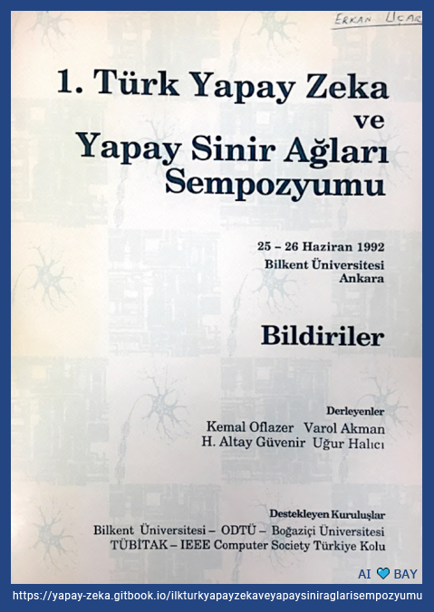

# 1. Türk Yapay Zeka ve Yapay Sinir Ağları Sempozyumu Bildirileri 🇹🇷
### 25–26 Haziran 1992 - Bilkent Üniversitesi - Ankara

:blue_book: **[Çevrimiçi Bildiri Kitabı'nın tamamına erişmek için tıklayın](https://yapay-zeka.gitbook.io/ilkturkyapayzekaveyapaysiniraglarisempozyumu/icindekiler)**

Yapay Zeka konusunda ülkemizin duayen araştırmacılarının yer aldığı ve düzenlediği Türkiye'nin ilk ilgili alandaki sempozyumunun bildiri kitabını okumuş olmaktan ve paylaşmaktan onur duyuyoruz. Bilişsel sinirbilimden bilgisayarlı görmeye, doğal dil işlemeden yapay zekanın hukuk konusunda ele alınmasına kadar bugün hala çözümler üretmeye çalıştığımız konularda değerli akademisyenlerin bizlere kazandırdığı vizyonu çevrimiçi ortamda herkesin okuyabilmesini, bu değerli bilgilerden yararlanmasını ve ilham almasını dileriz.

1992 yılında düzenlenen **1. Türk Yapay Zeka ve Yapay Sinir Ağları Sempozyumu**’ndan haberdar olmamızı sağlamakla beraber bildiri kitabını bize ulaştıran Sayın [Dr. Erkan Uçar](https://www.linkedin.com/in/erkanucar/) ve basılı halinden, çevrimiçi ortama taşınarak tarihe not düşmemiz konusunda motivasyonumuzu kırmayıp, bizi destekleyen Sayın [Prof. Dr. Kemal Oflazer’e](https://www.linkedin.com/in/kemal-oflazer-35b6b11/) ve sempozyumun tüm düzenleyicilerine teşekkürlerimizi sunarız.
Saygılarımızla,

[Başak Buluz](https://www.linkedin.com/in/basak-buluz-62800088/), [Merve Ayyüce Kızrak](https://www.linkedin.com/in/merve-ayyuce-kizrak/), [Yavuz Kömeçoğlu](https://www.linkedin.com/in/yavuzkomecoglu/)

> 1.Türk Yapay Zeka ve Yapay Sinir Ağları Sempozyumu Bildirileri Kitabı'nın çevrimiçi ortama taşınmasında emek veren Dolunay Balcılar, Ece Süsler, Gamze Ataman, Cansu Dursun isimli İstanbul Aydın Üniversitesi ABMYO Bilgisayar Programcılığı (İngilizce) öğrencilerine ayrıca teşekkür ederiz.
